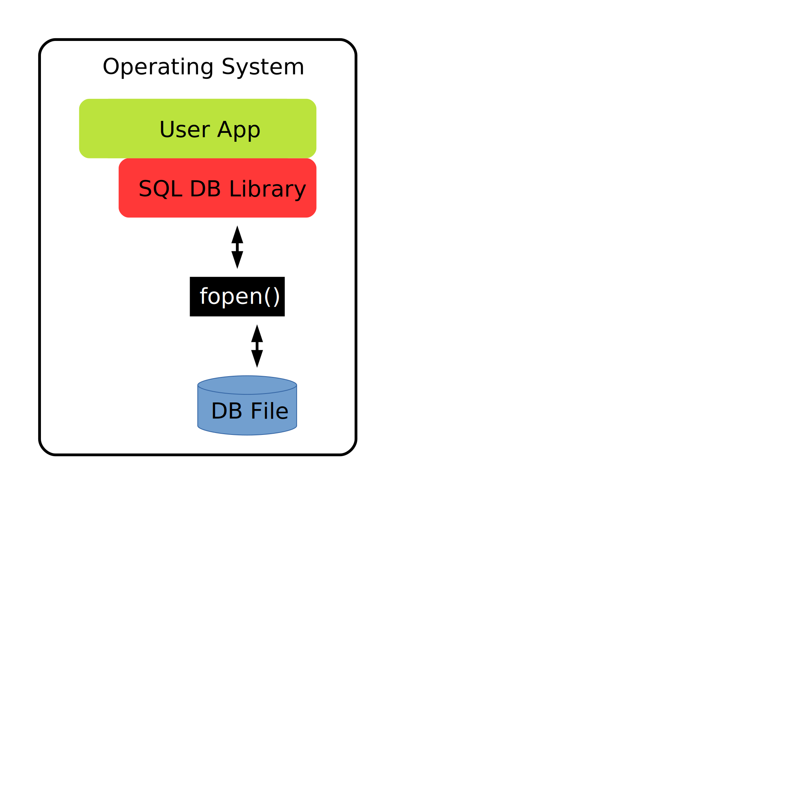
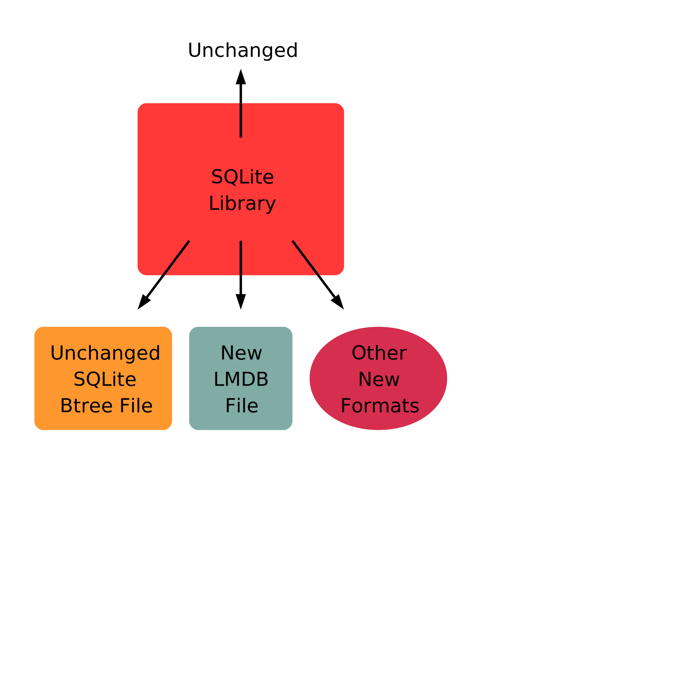

<!-- SPDX-License-Identifier: CC-BY-SA-4.0 -->
<!-- SPDX-FileCopyrightText: 2020 The LumoSQL Authors -->
<!-- SPDX-ArtifactOfProjectName: LumoSQL -->
<!-- SPDX-FileType: Documentation -->
<!-- SPDX-FileComment: Original by Dan Shearer, 2020 -->


Table of Contents
=================

   * [LumoSQL Architecture](#lumosql-architecture)
   * [Table of Contents](#table-of-contents)
   * [Online Database Servers](#online-database-servers)
   * [SQLite as an Embedded Database](#sqlite-as-an-embedded-database)
   * [LumoSQL Architecture](#lumosql-architecture-1)
   * [Database Storage Systems](#database-storage-systems)
      * [WALs in SQLite](#wals-in-sqlite)
      * [Single-level Store](#single-level-store)

LumoSQL Architecture
====================


# Online Database Servers

All of the most-used databases other than SQLite work over a network, here
called "online databases". This includes Postgresql, MariaDB, MySQL, SQLServer,
Oracle, and so on.


An online database server has clients that connect to the server over a
network. Once a network connection is opened, SQL queries are made by the
client and data is returned from the server. Although all databases use one of
the variants of the same SQL language, the means of connection is specific to each
database. 

For example, on a typical Debian Linux server there are these well-known ports:

```
foo@zanahoria:/etc$ grep sql /etc/services

ms-sql-s        1433/tcp                        # Microsoft SQL Server
ms-sql-m        1434/tcp                        # Microsoft SQL Monitor
mysql           3306/tcp                        # MySQL
postgresql      5432/tcp                        # PostgreSQL Database
mysql-proxy     6446/tcp                        # MySQL Proxy
```

with many other port assignments for other databases.

In the diagram above, each UserApp has a network connection to the SQL Database
Server on TCP port, for example 5432 if it is Postgresql. The UserApps could be
running from anywhere on the internet, including on mobile devices. There is a
limit to how many users one single database server can serve, in the many
thousands at least, but often reached for internet applications.


The most obvious way to scale an online database is to add more RAM, CPU and storage to a single server. This way all code runs in a single address space and is called "Scaling Up". The alternative is to add more servers, and distribute queries between them. This is called "Scale Out".

Nati Shalom describes the difference in the [article Scale-Out vs Scale-Up](http://ht.ly/cAhPe):

> One of the common ways to best utilize multi-core architecture in a context
> of a single application is through concurrent programming. Concurrent
> programming on multi-core machines (scale-up) is often done through
> multi-threading and in-process message passing also known as the Actor
> model.Distributed programming does something similar by distributing jobs
> across machines over the network. There are different patterns associated
> with this model such as Master/Worker, Tuple Spaces, BlackBoard, and
> MapReduce. This type of pattern is often referred to as scale-out
> (distributed).
>
> Conceptually, the two models are almost identical as in both cases we break a
> sequential piece of logic into smaller pieces that can be executed in
> parallel. Practically, however, the two models are fairly different from an
> implementation and performance perspective. The root of the difference is the
> existence (or lack) of a shared address space. In a multi-threaded scenario
> you can assume the existence of a shared address space, and therefore data
> sharing and message passing can be done simply by passing a reference. In
> distributed computing, the lack of a shared address space makes this type of
> operation significantly more complex. Once you cross the boundaries of a
> single process you need to deal with partial failure and consistency. Also,
> the fact that you can’t simply pass an object by reference makes the process
> of sharing, passing or updating data significantly more costly (compared with
> in-process reference passing), as you have to deal with passing of copies of
> the data which involves additional network and serialization and
> de-serialization overhead.

# SQLite as an Database Library

The user applications are tightly connected to the SQLite library. Whether by
dynamic linking to a copy of the library shared across the whole operating
system, or static linking so that it is part of the same program as the user
application, there is no networking involved. Making an SQL query and getting a
response involves a cascade of function calls from the app to the library to
the operating system and back again, typically taking less than 10 milliseconds
at most depending on the hardware used. An online database cannot expect to get
faster results than 100 milliseconds, often much more depending on network and
hardware. And online database relies on the execution of hundreds of millions
of more lines of code on at least two computers, whereas SQLite relies on the
execution of some hundreds of thousand on just one computer.




# How LumoSQL Architecture Differs from SQLite



# Database Storage Systems

LumoSQL explores several features that are in advance of every other
widely-used database. With the first prototype complete with an LMDB backend,
LumoSQL is already the first major SQL database to offer an alternative to batch
processing, since it has a backend that does not use Write-Ahead Logs.  LumoSQL
also needs to be able to use both the original SQLite and additional storage
mechanisms, and any or all of these storage backends at once. Not all future
storage will be on local disk, or btree key-values.

[Write-ahead Logging in Transactional Databases](https://en.wikipedia.org/wiki/Write-ahead_logging) has been the only
way since the 1990s that atomicity and durability are provided in
databases. A version of same technique is used in filesystems, where is is
called [journalling](https://en.wikipedia.org/wiki/Journaling_file_system).
Write-ahead Logging (WAL) is a method of making sure that all modifications to
a file are first written to a separate log, and then they are merged (or
updated) into a master file in a later step. If this update operation is
aborted or interrupted, the log has enough information to undo the updates and
reset the database to the state before the update began. Implementations need
to solve the problem of WAL files growing without bound, which means some kind
of whole-database snapshot or checkpoint is required.

WALs seek to address issues with concurrent transactions, and reliability in
the face of crashes or errors. There are decades of theory around how to
implement WAL, and it is a significant part of any University course in
database internals. As well as somewhat-reliable commit and rollback, it is the
WAL that lets all the main databases in use offer online backup features, and
point-in-time recovery. Every WAL feature and benefit comes down to being able
to have a stream of atomic operations that can be replayed forwards or
backwards.

WAL is inherently batch-oriented. The more a WAL-based database tries to be to
real time, the more expensive it is to keep all WAL functionality working. 

The WAL implementation in the most common networked databases is comprehensive
and usually kept as a rarely-seen technical feature. Postgresql is an exception, 
going out of its way to inform administrators how the WAL system works and what 
can be done with access to the log files.

All the most common networked databases describe their WAL implementation and
most offer some degree of control over it:

* [Postgresql](https://www.postgresql.org/docs/12/wal-intro.html)
* [SQL Server](https://docs.microsoft.com/en-us/sql/relational-databases/sql-server-transaction-log-architecture-and-management-guide?view=sql-server-ver15)
* [Oracle Log Writer Process](https://docs.oracle.com/en/database/oracle/oracle-database/19/cncpt/process-architecture.html#GUID-B6BE2C31-1543-4504-9763-6FFBBF99DC85)
* [MySQL ReDo Log](https://dev.mysql.com/doc/refman/8.0/en/optimizing-innodb-logging.html)
* [MariaDB Undo Log](https://mariadb.com/kb/en/library/innodb-undo-log/)

Companies have invested billions of Euros into these codebases, with stability
and reliability as their first goal. And yet even with all the runtime
advantages of huge resources and stable datacentre environments - even these
companies can't make WALs fully deliver on reliability. 

These issues are well-described in the case of Postgresql. Postgresql has an
easier task than SQLite in the sense it is not intended for unpredictable
embedded use cases, and also that Postgresql has a large amount of code
dedicated to safe WAL handling.  Even so, Postgresql still requires its users
to make compromises regarding reliability. For example [this WAL mitigation
article](https://dzone.com/articles/postgresql-why-and-how-wal-bloats)
describes a few of the tradeoffs of merge frequency vs reliability in the case
of a crash. This is a very real problem for every traditional database and that
includes SQLite - which does not have a fraction of the WAL-handling code of
the large databases, and which is frequently deployed in embedded use cases
where crashes and resets happen very frequently.

## WALs in SQLite 

SQLite WALs are special.

The [SQLite WAL]( https://www.sqlite.org/draft/wal.html) requires multiple
files to be maintained in synch, otherwise there will be corruption. Unlike the
other databases listed here, SQLite has no pre-emptive corruption detection and
only fairly basic on-demand detection.

## Single-level Store

Single-level store concepts are well-explained in [Howard Chu's 2013 MDB Paper](./lumo-relevant-knowledgebase.md#list-of-sqlite-code-related-knowledge):

> One fundamental concept behind the MDB approach is known as "Single-Level
> Store". The basic idea is to treat all of computer memory as a single address
> space. Pages of storage may reside in primary storage (RAM) or in secondary
> storage (disk) but the actual location is unimportant to the application. If
> a referenced page is currently in primary storage the application can use it
> immediately, if not a page fault occurs and the operating system brings the
> page into primary storage. The concept was introduced in 1964 in the Multics
> operating system but was generally abandoned by the early 1990s as data
> volumes surpassed the capacity of 32 bit address spaces. (We last knew of it
> in the Apollo DOMAIN operating system, though many other Multics-influenced
> designs carried it on.) With the ubiquity of 64 bit processors today this
> concept can again be put to good use. (Given a virtual address space limit of
> 63 bits that puts the upper bound of database size at 8 exabytes. Commonly
> available processors today only implement 48 bit address spaces, limiting us
> to 47 bits or 128 terabytes.) Another operating system requirement for this
> approach to be viable is a Unified BufferCache. While most POSIX-based
> operating systems have supported an mmap() system call for many years, their
> initial implementations kept memory managed by the VM subsystem separate from
> memory managed by the filesystem cache. This was not only wasteful
> (again, keeping data cached in two places at once) but also led to coherency
> problems - data modified through a memory map was not visible using
> filesystem read() calls, or data modified through a filesystem write() was not
> visible in the memory map. Most modern operating systems now have filesystem
> and VM paging unified, so this should not be a concern in most deployments.


